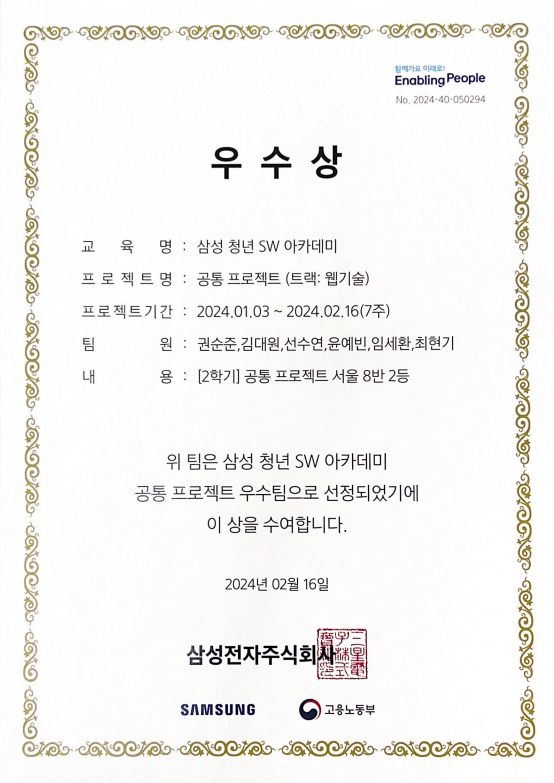
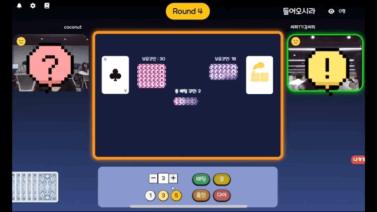
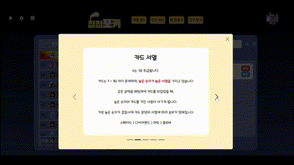

# **Ⅰ. 서비스 소개**

## 1. 서비스 설명

### 개요 📰

- 한줄 소개 : 온택트에 익숙해진 현대인을 위한 `웹 화상 게임`서비스
- 서비스 명 :**칩칩포커(ChipChipPoker)**
- 서비스 개발 기간: 2024.01.08 ~ 2024.02.16

### 타겟 🎯

- 새 학기를 맞이한 학생들
- 카드 게임 & 보드 게임을 좋아하는 사람들

### 성과 🥇
- #### SSAFY 10기 공통 프로젝트 우수상 수여


## 2. 기획 배경

### 배경 🗺️

인디언 포커 게임을 혹시 아시나요?
<br/>
어렵지 않은 룰임에도 꽤나 전략적인 게임이라 매니아 층이 두터운 게임인데요
<br/>
<br/>
친구들과 함께 이런 전략적인 게임을 즐길 때, 상대방의 **심리적인 부분**을 파악하는 것이 매우 중요한 포인트가 됩니다.
<br/>
또한, 카드 게임을 진행하려면 실물 트럼프 카드를 가지고 인원이 직접 모여서 진행해야하는 오프라인의 불편함이 있죠.
<br/>
<br/>
저희는 이러한 배경들을 토대로 **상대방의 표정을 보며** 좀 더 전략적으로 게임을 진행하고, **오프라인의 한계를 넘어서는** 
<br/>
온라인 인디언 포커 서비스, ***칩칩포커***를 개발하게 되었습니다.

### 목적 🥅

- **물리적, 공간적 제약 없이** 인디언 포커 게임을 즐기게 하자
- **상대방의 얼굴을 보며 심리적인 요소들을 추가**해 전략적으로 게임을 즐기게 하자.

### 의의

- 간단한 게임으로 서로를 더 잘 알아가고, 아이스브레이킹의 효과
- 비대면으로 직접 만나지 않고, 카드 없이도 즐길 수 있는 온라인 웹 화상 게임


## 3. 서비스 화면

### 서비스 화면 이미지

|  |   |  |
|:----------------------------------:|:----------------------------------------------:|:------------------------------------------------------------:|
|              게임 화면 1               |                    게임 화면 2                     |                           게임 화면 3                            |

|           |  |  |
|:------------------------------------------------------:|:----------------------------------------------------------:|:-----------------------------------------------------------:|
|                         랭킹 화면                          |                            가이드북                            |                           프로필 화면                            |

<br>

### 화면 설명


### 시연 영상

[](https://youtu.be/vLpCnBJbCUg)

# **Ⅱ. 기술스택**

### Frontend

- vue 3.3.11
- vue-router 4.2.5
- webstomp-client 1.2.6
- Face API

### Backend

- SpringBoot 3.2.1
- JDK 17
- QueryDSL 5.0.0
- MySQL
- MongoDB
- Spring Web Socket & Spring STOMP
- Prometheus & Grafana

### Infra

- aws
- nginx
- jenkins
- WebRTC(openvidu)
- Docker


# **Ⅲ. 게임 컨텐츠 소개**

## 게임 기본 설명

랜덤으로 카드를 뽑아 자신의 카드는 보지 않고 상대방의 카드만 본 채로 배팅을 하는 게임입니다.
<br/>
기본적인 룰은 높은 숫자를 가진 플레이어, 또는 마지막까지 살아남은 플레이어가 이기는 간단한 룰을 가지고 있습니다.
<br/>
심리적인 요소를 이용하여 상대방을 포기시킬 수도, 속일 수도 있는 전략이 필요한 게임입니다.

## 특별 기능

### 매칭

- 매칭은 친선모드와 경쟁모드로 나뉘며, 인원수를 선택할 수 있습니다.
- **친선 모드**
    - 해당 인원수의 게임방이 존재할 시 그 방으로 즉시 입장하며, 게임방이 존재하지 않는 경우에는 입장이 불가능합니다.
- **경쟁 모드**
    - 경쟁 모드 매칭을 통해 게임을 진행하면, 해당 인원이 전부 매칭이 될 때까지 대기하며 매칭이 완료될 시 즉시 게임방으로 이동합니다.
    - 경쟁 모드는 게임 종료 시 코인 개수에 따라, 유저의 포인트를 변화시키며 이를 기반으로 랭킹을 매길 수 있습니다.

### 관전

- 친선 모드의 게임을 관전할 수 있는 기능입니다. 관전을 통해 플레이어들의 카드와 표정을 보며 게임을 즐길 수 있습니다. 또한 관전자들끼리의 채팅도 가능합니다.

### 표정 인식

- 남들이 나의 표정을 보고 패를 가늠하게 하는 인디언 포커의 특성을 살리기 위해, 표정 인식 기능을 넣었습니다.
- 카메라의 좌측 상단의 이모티콘을 통해 분노, 역겨움, 행복, 슬픔, 놀람, 평온 등 상대의 표정에서 드러나는 가장 큰 감정이 무엇인지 알 수 있습니다.

# **Ⅳ. 프로젝트 진행**


- Git
    - Git Flow
        - git flow 사용을 위해`우아한 형제들`의 [git flow 사용](https://techblog.woowahan.com/2553/)을 참고했습니다. 각자 맡은 기능에 맞게`feature`브랜치를
          생성하고, 완료된 기능은`develop`에 merge하여 사용했습니다.
        - 충돌 상황을 최소하하기 위해 로컬 저장소 에서 `develop` 최신 버전을  `rebase` 옵션으로 `pull` 받고 이후 `develop` 브런치로 `merge` 하는 것을 규칙으로 했습니다.
        - 각 `pull request` 는 다른 파트 팀원에게 리뷰를 받고 공통된 템플릿을 통해 관리했습니다.
        - 각 `pull request` 는 `squash merge` 를 사용하여 각 기능에 대해 커밋을 깔끔하게 관리하고 변경사항에 대한 내용을 빠르게 추적할 수 있도록 했습니다.
        - 각 pull request 는 `[프론트or백엔드or기타] Jira Issue Name` 와 같이 작성했습니다.
    - Commit Convention
        - 또한`commit message`는`tag name: Description`와 같이 통일하여 작성했습니다.

            ```
            feat: 회원 가입 기능 구현
            
            SMS, 이메일 중복확인 API 개발
            
            Refs: #123
            ```

- Jira
    - 에픽, 스토리, 태스크
        - `에픽` 은 큰 기능 혹은 화면단위
        - `스토리` 는 기획, 설계, 디자인과 같은 비 개발작업
        - `태스크`는 에픽보다 작은 개발에 해당하는 모든 작업
    - 이슈 생성 규칙
        - 정형화 된 이슈 생성 규칙을 사용하여 이슈 추적에 원활하게 구성했습니다.
        - EX) 에픽인 경우 : [프론트] 메인페이지 제작 or 스토리 혹은 작업인 경우 : [프론트] 개발 전체 랭킹 리스트 컴포넌트
        - EX) 에픽인 경우 : [백엔드] 게임기능 제작 or 스토리 혹은 작업인 경우 : [백엔드] 개발 배팅기능

        ```
        [프론트/백엔드/데브옵스/기획] (작업이름)
        ```

    - 담당자 및 스토리 포인트 설정
        - 담당자와 스토리 포인트를 설정하고 개발하여 자원 관리 및 추적에 원활하게 구성했습니다.
- Notion
    - 자료 공유 방법

      

    - 모두가 공유해야할 자료 및 링크는 노션에 정리했습니다. 특히`userflow`나`api 명세`와 같이 여러번 다시 봐야하고 중요한 정보들은 특히 노션에 공유하여 불필요한 커뮤니케이션 리소스를 줄이기 위해
      노력했습니다.
- 스크럼
    - 매일 아침 각자 할 일과 어제 한일을 공유하는 스크럼을 진행했습니다. 스크럼을 통해 프로젝트의 진행 상황을 파악하고, 발생한 문제를 공유하며 애자일하게 프로젝트를 진행했습니다.
- Figma
    - Figma를 사용하여 화면 설계 진행했습니다.
      

- ERD
  

# **Ⅴ. 배포**

상세한 내용은 exec를 참고해주세요.

서버는 AWS EC2 Ubuntu 22.04을 사용했습니다.

- Domain: https://chipchippoker.shop, http://i10a804.p.ssafy.io
- CPU: vCPU 4
- Memory: 16GB
- Disk: 320GB SSD
- Traffic: 6TB
  

## 1. Docker

- OpenVidu 서버 포트 번호: 5443
- 시그널 서버 포트 번호: 8500
- WAS 포트 번호: 5442
- Prometheus & Grafana 포트 번호: 9090, 3000

서로 다른 이미지로 각각의 컨테이너를 실행하며, 동일 배포 단위는 Docker-compose 기술을 이용하여 다중 컨테이너 관리를 진행합니다.

## 2. DevOps

`Jenkins` 로 CI/CD를 구축하여 `develop` 브랜치에 `push` 이벤트 발생시 `build` 하도록 구성했습니다.

각 `frontend-develop` , `backend-develop` 으로 분리하여 `build` 되도록 구성했습니다.

생성된 `docker` 이미지를 컨테이너 기반으로 실행하도록 했습니다.

`Jenkins`로 CI/CD를 구축하여 develop 브랜치에`push`이벤트 발생시 `build` 하도록 구성했습니다.

`build` 후 `docker-compose`를 실행하도록 했습니다.

## 3. How to

### Jenkins

1. Jenkins 관리 > System > Jenkins Location 의 Jenkins URL을 맞게 설정합니다.
2. GitLab > (Connection name, GitLab host URL, Credentials) 을 각각 작성합니다.

1. 새로운 Item > PipeLine
2. gitlab 소스코드 관리(repository, branch 설정)
3. Build Trigger 를 설정합니다.
4. PipeLine Script 를 작성합니다

### Gitlab Webhook

1. Jenkins PipeLine > 구성 > Build Triggers > 고급에서 토큰을 발급합니다.
2. Gitlab Setting > Webhook > Add new Webhook > Secret Token에 발급받은 토큰을 작성합니다.
3. 생성된 Pipeline URL을 Webhook URL로 설정하고 push event를 추가합니다.

